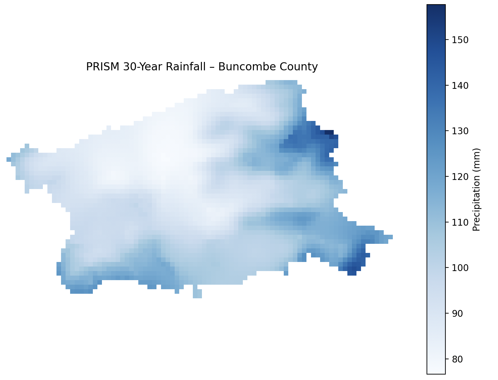
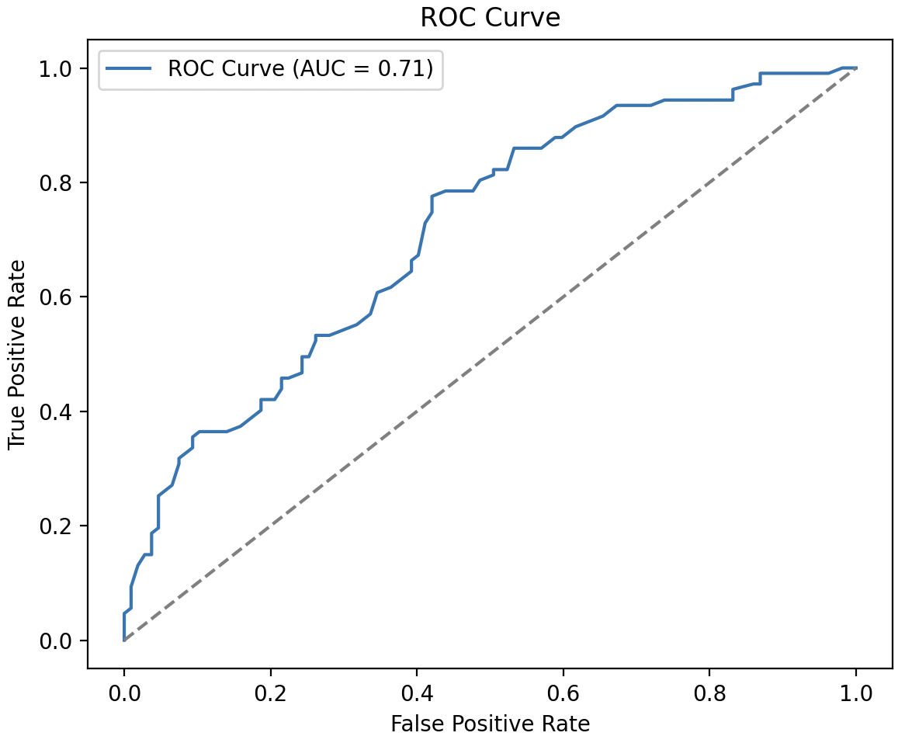
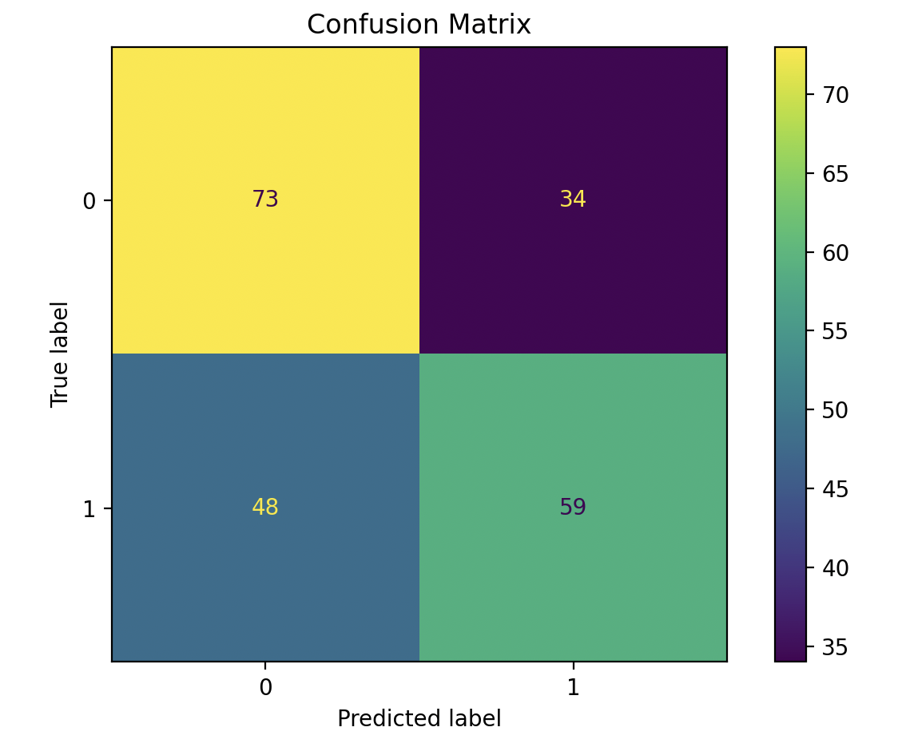

# Landslide Prediction in Buncombe County

This project uses GIS, rainfall data, and machine learning to predict landslide occurrence in Buncombe County, NC.

## 📁 Project Structure

## 📁 Project Structure

- `LandslideProcessing.py` — Generates random points, labels landslide and non-landslide data


- `RainfallBuncombe.py` — Processes rainfall data for Buncombe County  
  

- `BuncombeLandslide&slopeMap.py` — Combines landslide and slope maps for visualization  
  

- `main.py` — Orchestrates full pipeline from raw data to model-ready dataset

 — Model performance via ROC curve  
  

— Classification performance summary  
  

— Landslide Map using Random Forest Model
  

## 📊 Data Sources

- [USGS Landslide Inventory](https://www.usgs.gov/)
- [PRISM Climate Group](https://prism.oregonstate.edu/)
- [US Census TIGER/Line Shapefiles](https://www.census.gov/geographies/mapping-files/time-series/geo/tiger-line-file.html)
- `PRISM_ppt_30yr_normals/` — PRISM rainfall data used in the analysis
- `cb_2022_us_county_5m/` — Shapefiles for masking by county boundary

## 🚀 How to Run

1. **Install required Python libraries:**
```bash
pip install geopandas pandas shapely matplotlib
```

2. **Run the processing script:**
```bash
python LandslideProcessing.py
```

This will generate synthetic non-landslide points, merge them with actual landslide records, and output a labeled GeoDataFrame indicating whether each point is a landslide (1) or not (0).

## 🔗 External Data Folder (not included in GitHub)

Due to GitHub file size limits, large files are excluded. You can download the full dataset here:

> [Google Drive Folder](https://drive.google.com/your_shared_link)

Place all downloaded files inside a local `data/` folder.

## 📌 Output

The final dataset includes a unified GeoDataFrame containing spatial coordinates and an `IsLandslide` binary label, ready for use in machine learning models such as logistic regression or decision trees.

## 🧠 Author

Wonjun Choi  
Asheville School Research Project
