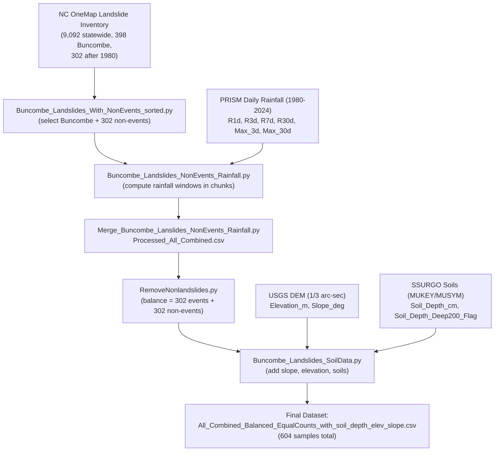

# Landslide Dataset Construction in Buncombe County

This project compiles a **GIS-based dataset** to support landslide prediction modeling in Buncombe County, NC.  
It integrates landslide inventory points, rainfall windows, DEM-derived slope, and soil depth to create a **balanced event/non-event dataset** for machine learning experiments.  

The work establishes the foundation for the modeling framework by preparing standardized, reproducible inputs.

---

## Project Overview

- **Goal:** Build a balanced dataset of rainfall-induced landslide events and non-events in Buncombe County.  
- **Methods:**  
  - Extract Buncombe County events from NC OneMap’s landslide inventory  
  - Generate equal-count non-events (random dates/locations)  
  - Aggregate rainfall windows from daily PRISM data (1980–2024)  
  - Add topographic predictors (elevation, slope from USGS DEM)  
  - Join SSURGO soil data and encode depth as binary flag  
  - Output balanced dataset for machine learning models  
- **Output:** Final CSV with events and controls enriched with rainfall, slope, elevation, and soil depth.

---

## Data Sources

- North Carolina Department of Environmental Quality. (2024). *North Carolina Landslide Inventory Points* [Data set]. NC OneMap. https://www.nconemap.gov/datasets/01965a193482438cb70332e5e524e38b_0/about  
- PRISM Climate Group. (2024). *PRISM Daily Precipitation Data (1981–present)* [Data set]. Oregon State University. https://prism.oregonstate.edu/  
- U.S. Geological Survey. (2022). *3D Elevation Program (3DEP), 1/3 arc-second DEM seamless products* [Data set]. https://www.sciencebase.gov/catalog/item/627f3798d34e3bef0c9a3198  
- U.S. Department of Agriculture, Natural Resources Conservation Service. (2024). *Soil Survey Geographic (SSURGO) Database* [Data set]. https://websoilsurvey.nrcs.usda.gov/app/  
- U.S. Geological Survey. (2021). *National Land Cover Database (NLCD) 2021* [Data set]. https://www.usgs.gov/centers/eros/science/national-land-cover-database  
- U.S. Census Bureau. (2022). *Cartographic Boundary Shapefiles – Counties* [Data set]. https://www.census.gov/geographies/mapping-files/time-series/geo/cartographic-boundary.html  

> **Note:** Rainfall data and DEM rasters are not included in this repository.  
> They can be downloaded from the above sources and placed in your local `LandslideData/` or `RainfallData/Rainfall` directories.

## Project Structure

- `Code/Data processing/Landslide/Buncombe_Landslides_With_NonEvents_sorted.py`  
  Selects Buncombe landslides from statewide dataset, generates equal non-events.  

- `Code/Data processing/Landslide/Buncombe_Landslides_NonEvents_Rainfall.py`  
  Computes rainfall features from PRISM in period chunks (1980–2004, 2005–2010, 2011–2016, 2017–2021).  

- `Code/Data processing/Landslide/Merge_Buncombe_Lanslides_NonEvents_Rainfall.py`  
  Merges processed chunks into a single dataset.  

- `Code/Data processing/Landslide/RemoveNonlandslides.py`  
  Balances event/non-event counts exactly.  

- `Code/Data processing/Soil/Buncombe_Landslides_SoilData.py`  
  Adds slope, elevation, soil depth flag to dataset.  

- **Final dataset:**  
  `LandslideData/FinalData/All_Combined_Balanced_EqualCounts_with_soil_depth_elev_slope.csv`

---

## Data Processing Workflow

1. **Inventory Extraction:**  
   - Start with NC OneMap landslide points (`North_Carolina_Landslide_Points.csv`).  
   - 9,092 statewide → 398 in Buncombe → **302 retained** (1980–2024).  

2. **Non-Events:**  
   - Generate 302 random points/dates within Buncombe (1980–2024).  

3. **Rainfall Features:**  
   - Download daily PRISM (1980–2024).  
   - Compute R1d, R3d, R7d, R30d, Max_Rainfall_3day, Max_Rainfall_30day.  

4. **Topography:**  
   - DEM (USGS 3DEP 1/3″) → `Elevation_m`, `Slope_deg`.  

5. **Soils:**  
   - Join SSURGO MUKEY/MUSYM at each point.  
   - Convert soil depth into numeric cm and binary flag (`Soil_Depth_Deep200_Flag`).  

6. **Final Merge:**  
   - Combine events, non-events, rainfall, slope, elevation, soil depth.  
   - Export as CSV for model training.  

---

## Data Dictionary

| **Column**               | **Units / Type**     | **Description**                                                                 |
|---------------------------|----------------------|---------------------------------------------------------------------------------|
| `IsLandslide`            | Binary (0/1)        | Target label: `1` = landslide event, `0` = non-event.                           |
| `Event_Date` / `Random_Date` | Date (YYYY-MM-DD) | Date of landslide occurrence or assigned non-event date.                        |
| `X`, `Y`                 | Meters (EPSG:32119) | Projected coordinates of sample point (NAD83 / NC State Plane).                 |
| `County`                 | String              | County name (all Buncombe for this dataset).                                    |
| `Elevation_m`            | Meters              | Ground surface elevation from DEM (USGS 3DEP 1/3 arc-second).                   |
| `Slope_deg`              | Degrees             | Slope steepness calculated from DEM (Horn’s 3×3 finite difference).             |
| `R1d`                    | Millimeters         | Total rainfall on event/control day.                                            |
| `R3d`                    | Millimeters         | Cumulative rainfall over 3 days ending on event/control date.                   |
| `R7d`                    | Millimeters         | Cumulative rainfall over 7 days ending on event/control date.                   |
| `R30d`                   | Millimeters         | Cumulative rainfall over 30 days ending on event/control date.                  |
| `Max_Rainfall_3day`      | Millimeters         | Rolling maximum of 3-day rainfall totals in the prior 30 days.                  |
| `Max_Rainfall_30day`     | Millimeters         | Rolling maximum of 30-day rainfall totals in the prior 90 days.                 |
| `Soil_Depth_cm`          | Centimeters         | Average soil depth from SSURGO map unit (numeric conversion of original rating).|
| `Soil_Depth_Deep200_Flag`| Binary (0/1)        | Soil depth indicator: `1` = ≥200 cm, `0` = <200 cm.                             |
| `MUKEY`, `MUSYM`         | String              | SSURGO soil map unit keys and symbols for location.                             |
| `GlobalID`, `OBJECTID`   | String / Integer    | Original NC OneMap inventory identifiers.                                       |
| `Data_Type`              | String              | Source classification of landslide record.                                      |
| `Source_Period`          | String              | Temporal source period for landslide record.                                    |

---

## Dataset Construction Flow

## Author

**Wonjun Choi**  
_Asheville School Senior (Class of 2026)_  
Student researcher focused on **geotechnical hazard prediction, GIS, and machine learning applications**.  
This project is part of an independent research initiative on **rainfall-induced landslides in Western North Carolina**.